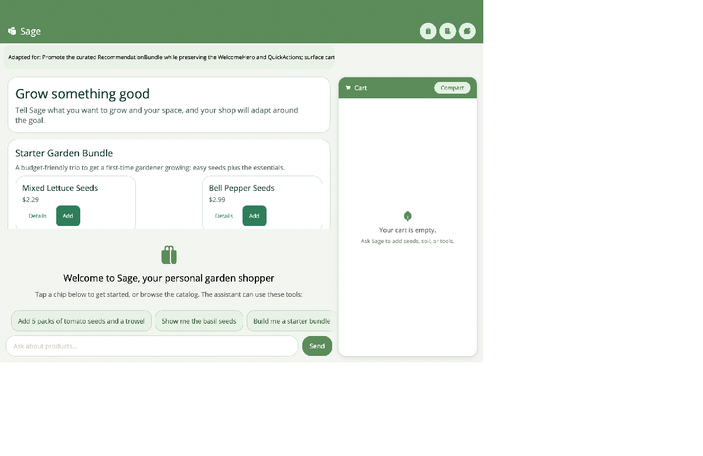
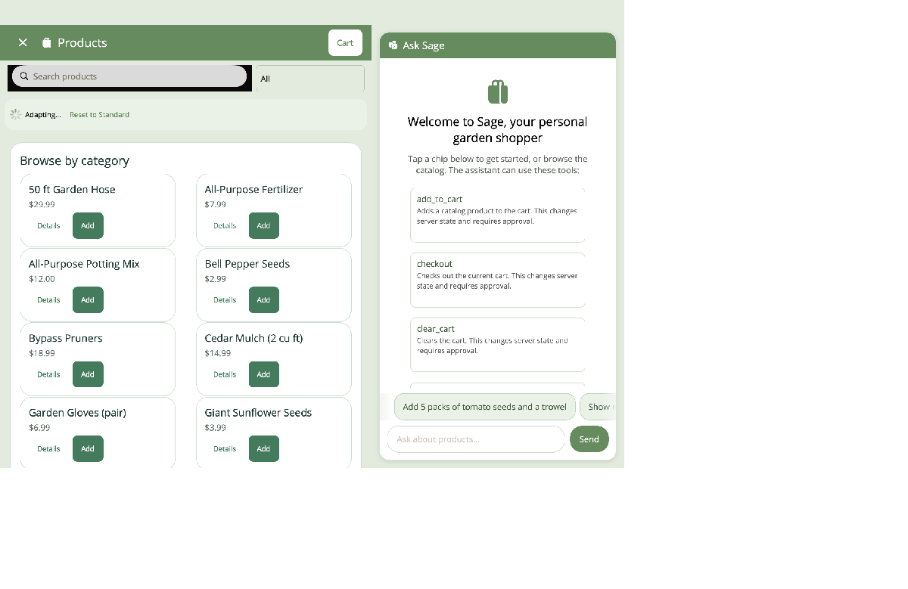

# Sample: AIExtensions.Sample.Garden

> **Status:** Implemented adaptive Garden reference app.

`AIExtensions.Sample.Garden` is the single Garden client for AI Extensions and Generative UI. It is a
real server-backed shopping application with fixed Shell navigation, a persistent assistant, typed
source-generated tools, and adaptive whole-component regions on every primary surface.



## Projects

```text
samples/
├── AIExtensions.Sample.Garden.Shared/      typed Product, Cart, Order, Review, and Recommendation DTOs
├── AIExtensions.Sample.Garden.Server/      canonical in-memory ASP.NET Core API
├── AIExtensions.Sample.Garden.Components/  whole components, catalog, standard layouts, state projector
└── AIExtensions.Sample.Garden/             MAUI Shell, pages, typed client/store, chat, coordinator integration
```

There is no duplicate blank-canvas Garden project and no mode picker.

## Surfaces

| Surface | Checked-in standard | Adaptive alternatives | Fixed essential actions |
|---|---|---|---|
| Home | Welcome + quick actions | recommendations, cart/orders summaries, seasonal tip | Catalog, Cart, Orders navigation |
| Catalog | Category shelves | grid, list, recommendations, comparison, explicit empty state | Search/filter, open product, add to cart |
| Product | Hero + core info + reviews | dimensions, colors, growing timeline, related products, stock | Back, add to cart, review |
| Cart | Items + totals | compact items, budget summary, add-ons, explicit empty state | Quantity, remove, clear, checkout |
| Orders | Orders list | stats, timeline, summary/detail, explicit empty state | Open, reorder, clear all |



Each page instance derives from `AdaptiveContentPage`, owns an isolated `AdaptiveSurfaceSession`, and
renders its standard layout before background composition starts. The page keeps fixed navigation,
loading/error/retry UI, and essential actions outside the adaptive region.

## Automatic adaptation

The assistant does not call a compose tool. `ChatViewModel` publishes normalized user intent to
`AdaptiveSurfaceCoordinator`. When the user navigates, the destination page contributes its surface,
viewport, typed data, and instance identity. The coordinator debounces, cancels stale work, composes,
validates, reconciles, and reports an "Adapted for …" explanation.

Reset restores the checked-in standard and clears presentation intent. Generation failure preserves
the current valid layout.

## Typed server and state

`AIExtensions.Sample.Garden.Server` owns catalog, cart, order, review, and recommendation state.
Shared records and `GardenJsonContext` are used by both server and client. `GardenApiClient` is the
only HTTP adapter, while `GardenDataStore` keeps observable typed client state and explicit
loading/error/retry behavior.

`GardenAdaptiveContextFactory` projects typed snapshots into `UiObject` only for data binding.
`UiObject` is never the canonical application state.

## Assistant tools

The explicit `GardenShopTools` context includes:

| Area | Tools |
|---|---|
| Catalog | `list_products`, `get_product`, `get_recommendations` |
| Cart | `get_cart`, `add_to_cart`, `set_cart_quantity`, `remove_from_cart`, `clear_cart` |
| Orders | `list_orders`, `get_order`, `checkout`, `reorder`, `clear_orders` |
| Reviews | `list_reviews`, `get_product_reviews`, `submit_review` |
| Navigation | `navigate_to_page`, `dismiss_page` |

The app does not expose `OpenApiExplorerTools`, `GenerativeUiTools`, `render_ui`, `apply_patch`, or a
Garden compose tool to the model.

## Approval and direct actions

Every AI-initiated server mutation is marked `ApprovalRequired = true`. The chat pauses for explicit
approval before it invokes the typed store.

Human taps call `IGardenComponentActions`, then the typed store/client, directly. They never enter the
AI approval flow. Navigation tools are read-only orchestration and do not require approval.

## Responsive persistent chat

`ChatViewModel` is a singleton. Conversation, approval state, and recent presentation intent survive
navigation. On wide windows, pages show a 420-DIP chat sidebar; narrow layouts prioritize the active
shopping surface while retaining the chat-first Home experience.

## Run

Configure the shared AI Extensions secrets:

```bash
dotnet user-secrets --id ai-attributes-secrets set "AI:Endpoint" "<your-endpoint>"
dotnet user-secrets --id ai-attributes-secrets set "AI:ApiKey" "<your-key>"
dotnet user-secrets --id ai-attributes-secrets set "AI:DeploymentName" "<your-deployment>"
```

Start the server, then the app:

```bash
dotnet run --project samples/AIExtensions.Sample.Garden.Server
dotnet build samples/AIExtensions.Sample.Garden -t:Run -f net10.0-maccatalyst
```

Desktop and iOS simulator use `http://localhost:5225`; Android emulator uses
`http://10.0.2.2:5225`. Override with `Api:BaseAddress`.

## Suggested acceptance flow

1. Launch with the server unavailable; confirm the standard remains visible and Retry is actionable.
2. Browse Catalog, open a product, add it, checkout, open the order, and reorder using direct buttons.
3. Ask Sage for a compact cart or a basil starter bundle; confirm intent follows navigation and the
   target surface adapts without a compose tool call.
4. Request an AI mutation; confirm approval is required.
5. Resize wide/narrow and confirm chat/content remain readable.
6. Reset an adapted surface and confirm the standard layout returns.
